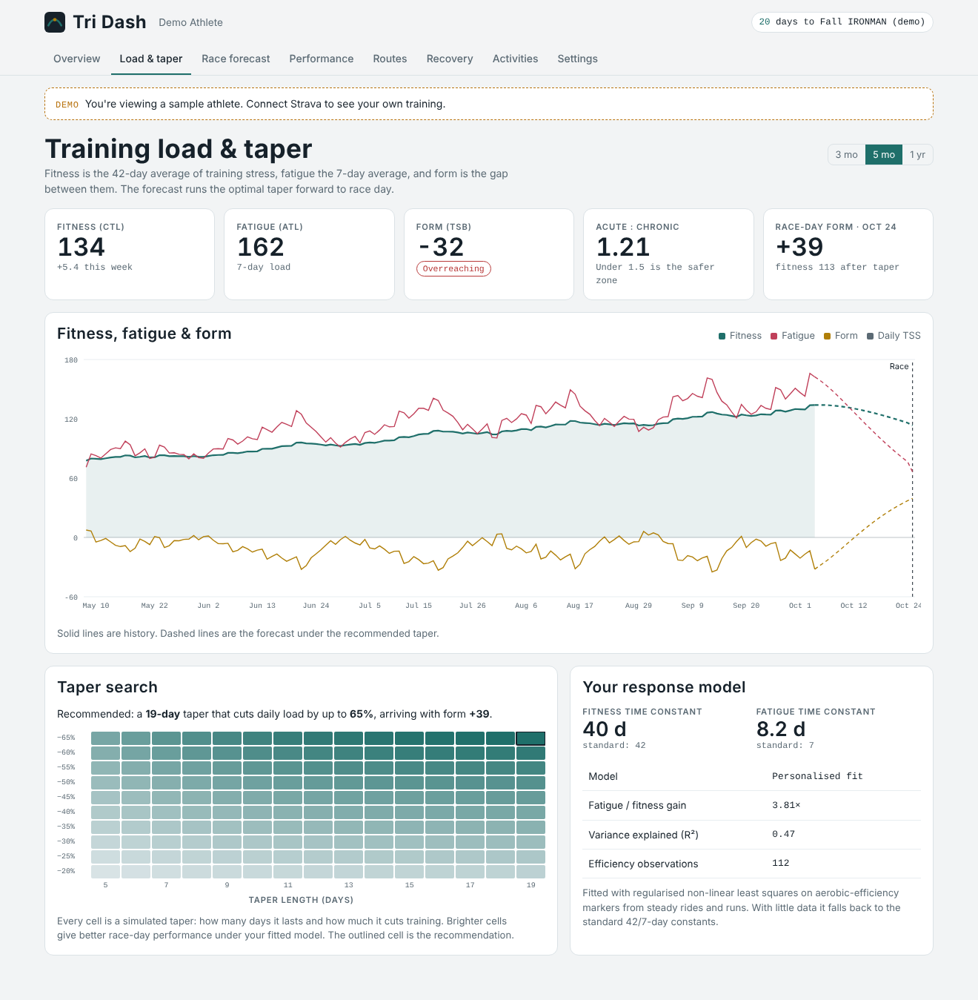
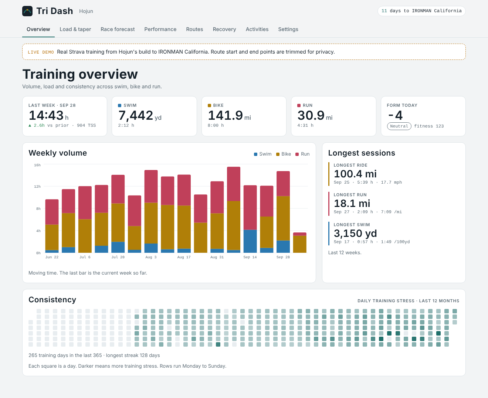
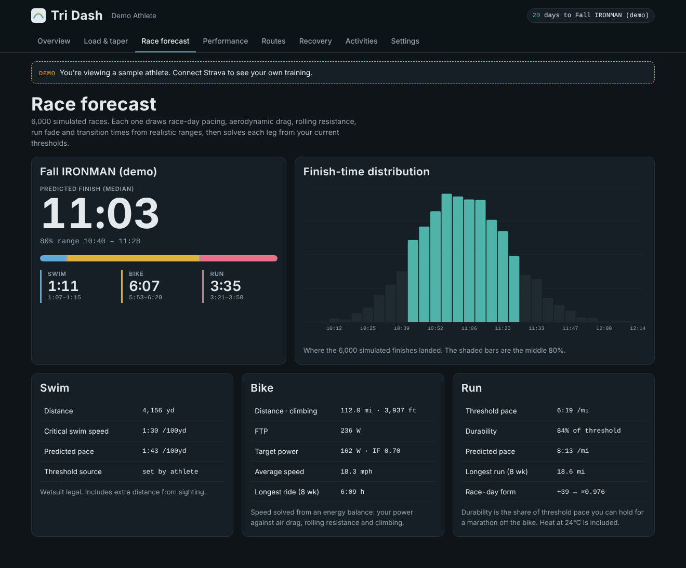
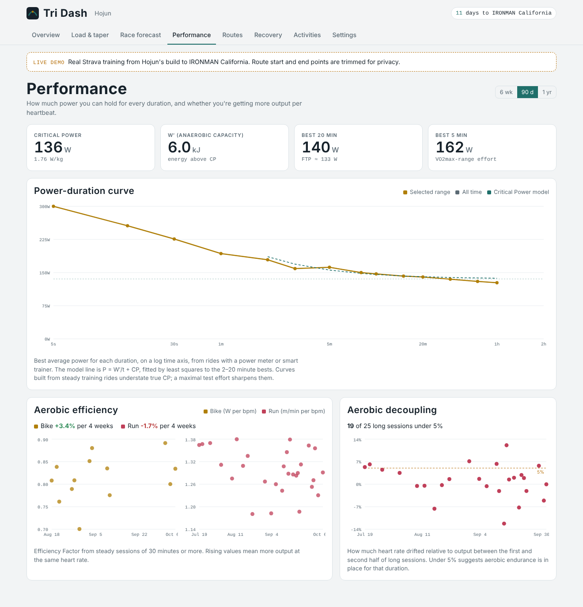
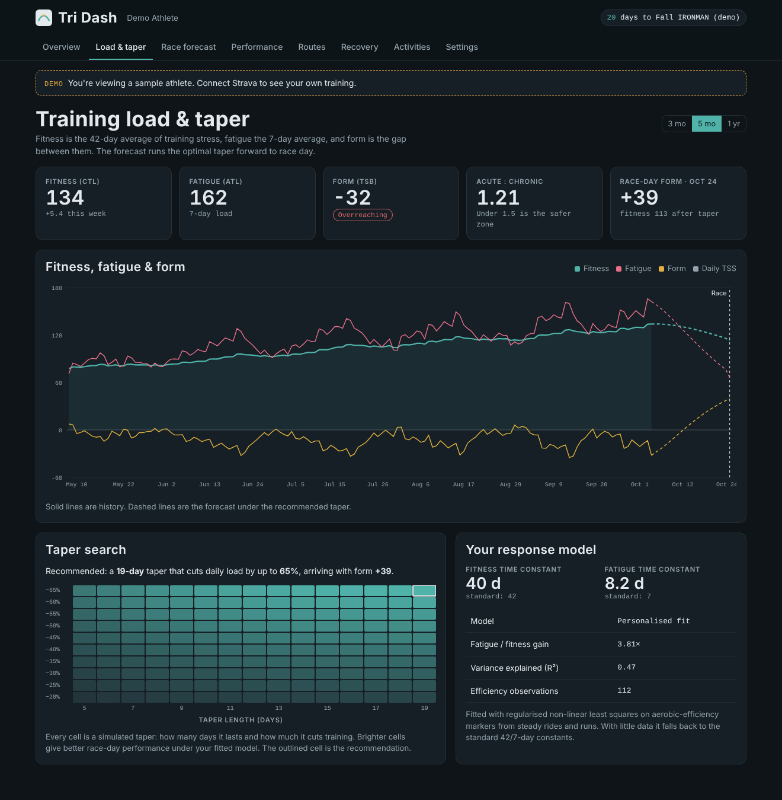
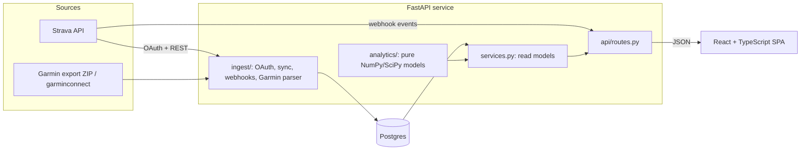

# Training Dash

**Endurance training analytics, from the mile to the Ironman.** Training Dash pulls workouts from Strava and recovery data from Garmin. It scores every session on one training-stress scale and fits a fitness-fatigue model to the athlete's own data. From that model it searches for the best taper, then simulates race day thousands of times to predict a finish time with a realistic range, for running races (1 mile, 5K, 10K, half marathon, marathon) and triathlons (sprint, Olympic, 70.3, full Ironman).

The live demo runs on my own training: about 600 Strava sessions from January 2026 through the final weeks before **IRONMAN California (October 18, 2026)**.



| | |
|---|---|
|  |  |
|  |  |

## What it does

| Area | Details |
|---|---|
| **Ingestion** | Strava OAuth, full-history backfill, incremental sync and real-time webhooks (create, update, delete, deauthorize). Token refresh and rate-limit backoff are handled. Garmin wellness comes from the official account export (ZIP), with an optional live sync. |
| **Training stress** | Each workout is scored by the most accurate method its data allows: power TSS from Normalized Power, rTSS from grade-adjusted pace (Minetti cost-of-running model), sTSS from swim pace (cubed intensity), or hrTSS from Banister TRIMP. Workouts with only a Strava summary use Relative Effort, rescaled to TSS by a factor calibrated on the athlete's own workouts that have both. Duration is the last resort. |
| **Fitness, fatigue, form** | Exponentially weighted 42/7-day load, ramp rate and acute:chronic workload ratio. |
| **Personal response model** | A Banister impulse-response model fitted to the athlete's aerobic-efficiency markers by regularised non-linear least squares. With a short history it falls back to population constants. |
| **Taper optimiser** | A grid search over taper length and depth, with each candidate scored by the fitted model's predicted race-day performance. |
| **Race prediction** | A Monte Carlo simulation of 6,000 races at any of nine distances, picked from a dropdown. Running races stretch threshold pace to the distance with Riegel's power law, then apply a durability factor (long runs and fitness, relative to the race distance) and heat. Triathlons add the swim from Critical Swim Speed and the bike from a physics energy balance (aero drag, rolling resistance, climbing, drivetrain loss), with pacing and transition times set per distance. Output is the P10/P50/P90 range for each leg. |
| **Performance** | Mean-maximal power curve with a Critical Power / W′ fit, Efficiency Factor trends and aerobic decoupling. |
| **Routes** | A layered map of every outdoor ride and run, decoded from Strava polylines. |
| **Recovery** | HRV against a rolling 60-day baseline, resting HR, sleep, Body Battery, and the correlation between yesterday's load and this morning's HRV. |

## Architecture



* **`backend/app/analytics/`** holds pure functions with no I/O. Each model is unit-tested against known values: Coggan's 1 h at FTP = 100 TSS, Google's polyline example, and parameter recovery from synthetic data for the Banister and Critical Power fits.
* **`backend/app/ingest/`** talks to Strava and Garmin. These tests run the real sync code against a mocked Strava API (`respx`), covering token refresh, 429 retries, idempotent upserts and webhook events.
* **`backend/app/services.py`** builds every view the UI needs from stored activities, so the HTTP layer stays thin.
* **`frontend/`** is a React 19 app with TanStack Query, Recharts and Leaflet. In production FastAPI serves the built app, so one container serves everything and the session cookie stays first-party.

## The models, briefly

**Training Stress Score.** `TSS = hours × IF² × 100`, where IF is intensity relative to threshold. Normalized Power (30 s rolling mean, 4th-power average) weights surges the way the body feels them. Swimming uses IF³ because drag rises with the square of speed.

**Banister model.** Performance is modelled as `p(t) = p₀ + k₁·Σ w(s)e^{−(t−s)/τ₁} − k₂·Σ w(s)e^{−(t−s)/τ₂}`. The kernel sums are computed recursively in O(n). The fit uses a soft-L1 loss and a prior pulling parameters toward (k₁, k₂, τ₁, τ₂) = (1, 2, 42, 7), and it is rejected if fatigue would outlast fitness (τ₂ ≥ τ₁).

**Bike leg.** The bike time T is solved with Brent's method from
`P·η·T = (½ρ·CdA·v³ + Crr·m·g·v)·T + m·g·H·(1 − r)`, where `v = D/T`.
CdA, Crr and race-day intensity are drawn from distributions in each simulation.

**Run races.** Threshold is roughly one-hour race pace, so it anchors Riegel's `T₂ = T₁·(D₂/D₁)^1.06` at `T₁ = 3600 s`. Shorter races come out faster than threshold and longer ones slower; the half and full marathon are further discounted when recent long runs fall short of the distance.

**Critical Power.** Work against time is linear (`W = CP·t + W′`), so CP and W′ come from ordinary least squares on the 2–20 minute bests.

## Running it

```bash
cp .env.example .env            # add Strava API credentials to use real data
make install                    # Python venv (uv) + npm install
make demo                       # seed the demo athlete
make api                        # FastAPI on :8000
make web                        # Vite on :5173, proxying /api
```

Or run it with Docker and Postgres:

```bash
docker compose up --build       # http://localhost:8000
```

To use your own Strava data, create an API app at <https://www.strava.com/settings/api>, set its callback domain to your host, and put the client ID and secret in `.env`. To receive webhooks, register a subscription pointing at `https://<host>/api/webhooks/strava`.

## Tests and CI

```bash
make test    # pytest (70 tests, ~85% coverage) + vitest
make lint    # ruff, tsc, oxlint, prettier
```

GitHub Actions runs linting, type checks and both test suites. It also applies the Alembic migrations to a real Postgres service container and builds the Docker image.

## Deploying

`render.yaml` defines the web service and a Postgres database for Render Blueprints. Any Docker host works: run the image with `DATABASE_URL`, `SECRET_KEY` and the Strava settings. On start, the container runs migrations and seeds the demo athlete if one doesn't exist.

## Data and privacy

The public demo loads a snapshot of my own Strava history (`backend/app/fixtures/athlete.json.gz`), built by `tools/build_snapshot.py`. The builder:

* trims 500 m from both ends of every route, so start and finish points (usually home) are never published
* drops Zwift "routes", which are virtual-world coordinates
* keeps smart-trainer power for the power curve and efficiency trends, but scores those rides by heart rate by default, since trainer power often reads differently from outdoor power (`--trust-trainer-power` changes this)

`python -m app.demo --synthetic` loads a fully synthetic athlete instead. Its data comes from a hidden Banister model, so the fitting code has a known signal to recover, and it backs the API test suite.

Connected athletes only ever see their own data, and the demo athlete is read-only. Strava tokens are stored server-side and cleared when the athlete revokes access.

**What the real data shows about the models.** On this history the efficiency markers are too sparse and noisy to support a personal Banister fit (R² under 0.15), so the app says so and uses the standard 42/7-day constants rather than present an overfit. On the synthetic athlete, where the signal is known, the same code recovers the true time constants.
